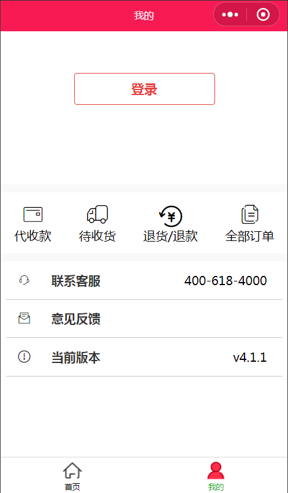

# 爱拼团

## 分析业务

### 两个页面 

- `1.主页(展示商品信息)`

- `2.我的(个人信息)`

## 一.首页

- `首页(图片)`

- `规划整体结构`

 1. 搜索栏

 2. 轮播图  

 3. 分类导航栏

 4. 商品信息及图片

## 二.我的

- `未登录(图片)`

- `登录(图片)`

- `规划整体结构`

1. 登录按钮/个人头像，昵称

2. 订单查询

3. 系统服务

### 分析业务 动手操作

一 .根据业务设置小程序初始化样式文件

1. `文件(app.json)`

2. `文件(app.wxss)`

二 .编写页面样式

1. `文件(/pages/index)`

2. `文件(/pages/index1)`

三 .分析业务逻辑需求添加事件，功能

1. `文件（/pages/index1.js）`

- 点击登陆按钮获取个人数据渲染页面

- 刷新页面不需要重复登录
